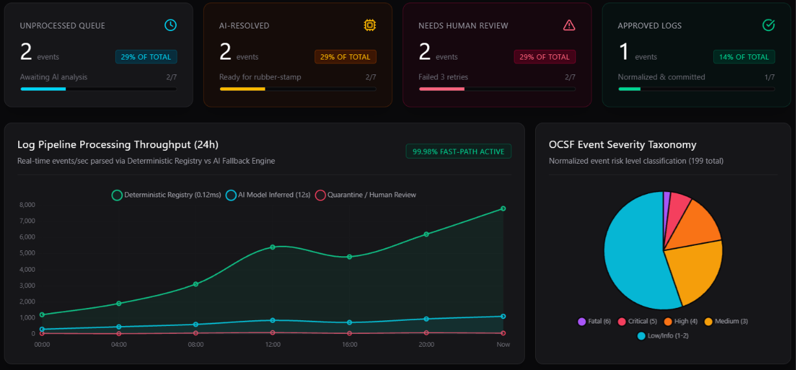
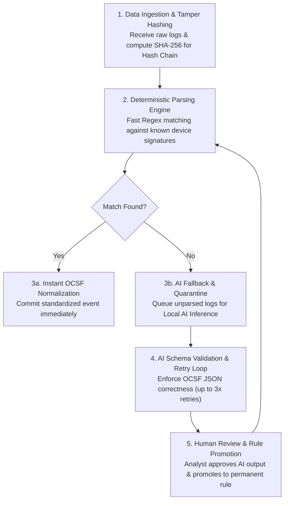
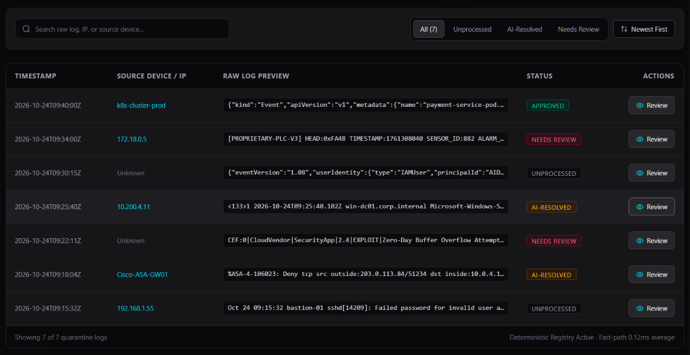
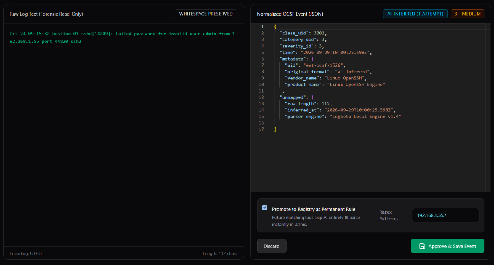
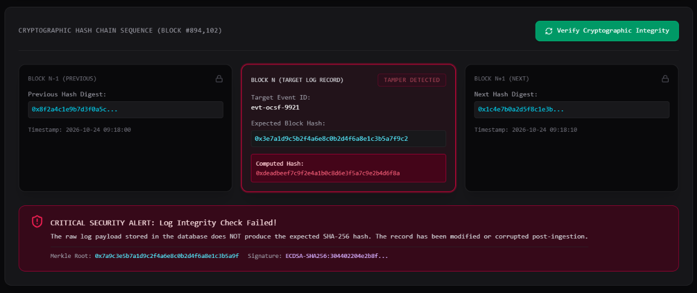
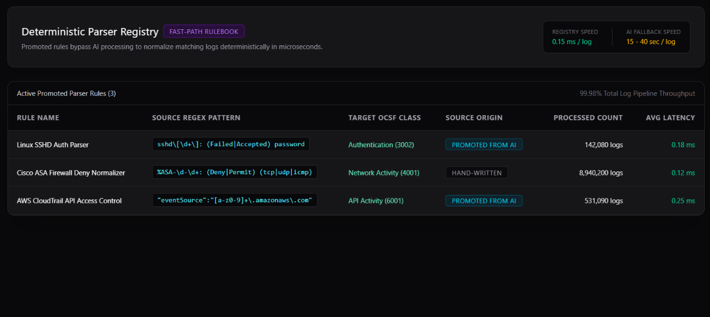
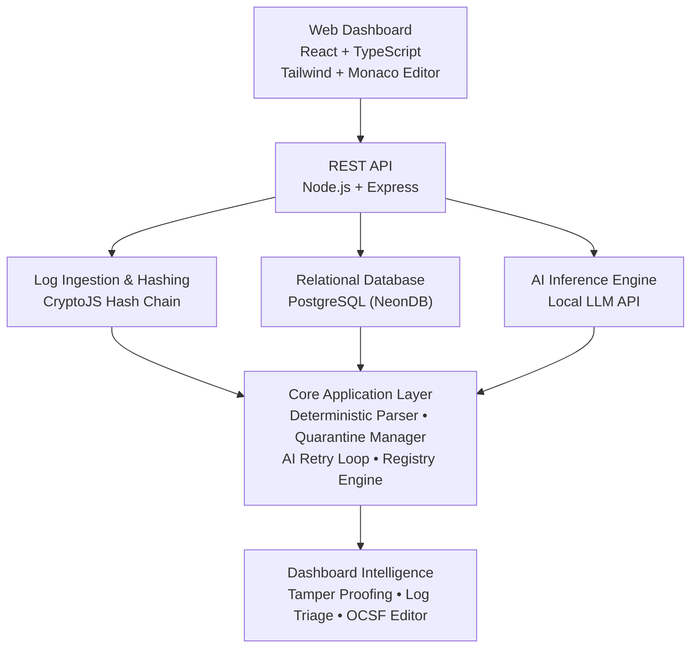

# Logसेतु (LogSetu) — Universal Log Pre-processing Framework

**Logसेतु (LogSetu)** is an enterprise-grade, web-based **Security Log Normalization & Tamper-Verification** platform designed to parse heterogeneous log sources into the standardized **OCSF (Open Cybersecurity Schema Framework)** event taxonomy. By leveraging deterministic high-speed parsers, a local AI inference engine, and cryptographic hash chains, Logसेतु identifies, standardizes, and secures security events long before they reach the SIEM—empowering security analysts to safeguard high-value infrastructure.

The platform provides a unified operational environment combining **live raw log ingestion, automated deterministic parsing, on-device AI schema inference, interactive OCSF JSON editing, cryptographic tamper-evidence verification, and permanent rule promotion.**

---

## Platform Overview


> *Figure 1: Logसेतु Main Dashboard — Real-time telemetry overview, live log ingestion triage HUD, and OCSF normalization status.*

---

## Processing Pipeline

Logसेतु processes security logs through a modular five-stage execution pipeline:



The pipeline operates continuously, rapidly processing known logs through the deterministic registry while seamlessly routing unrecognized formats to the AI for intelligent inference, constantly growing the system's knowledge base.

---

## Key Modules & Screenshots

### 1. Pipeline Triage HUD & Ingestion Queue
- **Automated Source Extraction**: Ingests raw text logs from any device (Firewalls, IDS/IPS, CloudTrails) and automatically extracts source IP or hostname telemetries.
- **Real-Time Throughput Analytics**: Monitors unprocessed logs, active alerts, and severe event counts.


> *Figure 2: Pipeline Operations HUD & Live Log Queue showing real-time throughput trends and quarantine triage counters.*

---

### 2. Quarantine Queue & Log Triage
- **Isolated Triage Queue**: Differentiates processed events from unrecognizable logs, placing the latter in an organized, filterable quarantine table for analyst review.
- **Resolution Tracking**: Tracks state transitions (`UNPROCESSED`, `AI_RESOLVED`, `NEEDS_REVIEW`, `APPROVED`).


> *Figure 3: Quarantine Queue — Filterable triage table displaying raw log events, source IPs, and AI inference statuses.*

---

### 3. Split-Pane Log Review & Monaco Editor
- **Split-Pane Forensics**: Dual-view interface rendering the raw log side-by-side with the AI-generated OCSF JSON mapping.
- **Live Monaco JSON Editor**: Integrates Monaco Editor (`@monaco-editor/react`) for syntax-highlighted, interactive modifications of the AI's proposed JSON structure.
- **Rule Promotion**: Promotes approved mappings into permanent Regex rules to bypass AI processing for identical log patterns in the future.


> *Figure 4: Split-Pane Log Review — Raw log text on the left, interactive Monaco OCSF JSON editor on the right with rule promotion controls.*

---

### 4. Cryptographic Tamper-Evidence Auditor
- **Immutable Hash Chains**: Computes SHA-256 hashes of the original raw log payload at ingestion, linking each new log to the previous log via a `prevHash` pointer.
- **Merkle Trees & HMAC Signatures**: Employs Merkle roots and HMAC-SHA256 signatures to prove absolute data integrity against unauthorized database modifications.
- **Live Re-verification**: Dynamically re-computes log hashes on demand to prove cryptographic truth.


> *Figure 5: Tamper-Evidence Panel — Cryptographic hash chain ledger and live integrity verification tool.*

---

### 5. Deterministic Parser Registry
- **High-Speed Regex Matching**: Catalog of active deterministic rules converting known log structures into valid OCSF JSON without AI overhead.
- **Self-Expanding Knowledge Base**: Searchable rulebook displaying RegEx patterns, mapped OCSF classes, and origin source (`Manual` vs `AI-Promoted`).


> *Figure 6: Parser Registry — Searchable catalog of deterministic parsing rules and RegEx pattern signatures.*

---

## Technical Architecture



### Component Breakdown

| Layer | Technology | Primary Function |
|---|---|---|
| **Presentation Layer** | React 18, TypeScript, Tailwind CSS, Framer Motion | User interface, split-pane layout, data tables, and tab management |
| **Editors & Charts** | Monaco Editor, Chart.js (`react-chartjs-2`) | Interactive JSON code editing and throughput/severity visualizations |
| **API Layer** | Node.js, Express 4, cors | REST endpoints for log ingestion, AI proxying, and cryptographic verification |
| **Data Layer** | Prisma ORM, PostgreSQL (NeonDB) | Strongly-typed relational data models for logs, rules, and hash chains |
| **Computation Engine** | CryptoJS, Custom Validation logic | Hash chain generation, HMAC signing, and strict OCSF JSON schema validation |

---

## Technology Stack

### Frontend Core
- **Framework:** React 18 & TypeScript
- **Build System:** Vite (Fast HMR & ESM bundling)
- **Styling:** Tailwind CSS (Clean, dark SIEM aesthetic)
- **Code Editor:** `@monaco-editor/react` (JSON schema validation & syntax highlighting)
- **Data Visualization:** Chart.js & `react-chartjs-2` (Log throughput trends & severity charts)
- **UI Animations:** Framer Motion

### Backend Core
- **Server Framework:** Node.js & Express 4
- **ORM & Database:** Prisma 6 with Serverless PostgreSQL (NeonDB)
- **Cryptography:** CryptoJS (SHA-256, HMAC, Merkle Roots)
- **Validation:** Custom OCSF property enforcement logic

---

## Project Structure

```text
ULPF/
│
├── docs/
│   └── images/                # Application UI screenshots
│       ├── Platform_Overview.png
│       ├── Quarantine_Queue.png
│       ├── Log_Review.png
│       ├── Tamper_Evidence.png
│       └── Parser_Registery.png
│
├── frontend/
│   ├── src/
│   │   ├── components/
│   │   │   ├── common/        # Badges, Header, Stat cards, Dashboard charts, Splash screen
│   │   │   ├── quarantine/    # Quarantine Queue data tables & HUD stats
│   │   │   ├── registry/      # Parser Registry UI
│   │   │   ├── review/        # Split-Pane Log Editor
│   │   │   └── tamper/        # Cryptographic Hash Chain verification UI
│   │   │
│   │   ├── api/               # REST client bindings (mock fallbacks)
│   │   ├── types/             # TypeScript interfaces for OCSF and Logs
│   │   ├── App.tsx            # Main state manager and view switcher
│   │   └── main.tsx           # React DOM entry point
│   │
│   ├── public/                # Static assets (Favicon)
│   ├── package.json
│   └── vite.config.ts
│
├── backend/
│   ├── src/
│   │   ├── lib/               # AI Client logic, Hash utilities, Prisma singleton
│   │   ├── routes/            # Express routes (quarantine, parseLog, verify, registry)
│   │   └── server.ts          # Express API server & CORS configuration
│   │
│   ├── prisma/
│   │   ├── schema.prisma      # PostgreSQL Database Models
│   │   └── seed.ts            # Demo data seed script
│   │
│   ├── package.json
│   └── tsconfig.json
│
├── Project_Explanation.md     # In-depth file-by-file technical documentation
├── ULPF_Frontend_Brief.md     # Frontend architectural brief
├── .gitignore                 # Unified monorepo ignore rules
└── README.md                  # System overview and deployment guide
```

---

## Getting Started

### Prerequisites
- **Node.js**: v18.0.0 or higher
- **npm**: v9.0.0 or higher
- **PostgreSQL**: Local database or NeonDB connection string

### 1. Clone the Repository
```bash
git clone https://github.com/Ri1tik/ULPF.git
cd ULPF
```

### 2. Start the Backend API Server
Open a terminal window:
```bash
cd backend
# Install Node dependencies
npm install

# Copy environment variables
cp .env.example .env
# Important: Set your NeonDB/Postgres DATABASE_URL inside .env

# Push the Prisma schema and generate the client
npm run db:push
npm run db:generate

# Seed the database with demo logs
npm run db:seed

# Launch the Express server
npm run dev
```
The REST API will initialize on `http://localhost:8000`.

### 3. Start the Frontend Application
Open a second terminal window:
```bash
cd frontend
# Install Node dependencies
npm install
# Launch Vite development server
npm run dev
```
Open your browser to `http://localhost:5173/` to explore Logसेतु!

---

## Contributing
Contributions, issues, and feature requests are welcome! 
1. Clone the Repository (`git clone https://github.com/Ri1tik/ULPF.git`)
2. Create your Feature Branch (`git checkout -b feature/AmazingParser`)
3. Commit your Changes (`git commit -m 'Add some AmazingParser'`)
4. Push to the Branch (`git push origin feature/AmazingParser`)
5. Open a Pull Request

---

## References & Data Credits
- **Open Cybersecurity Schema Framework (OCSF)** — Standardized taxonomy for security events.
- **CryptoJS** — Cryptographic hashing algorithms.
- **Monaco Editor** — The code editor that powers VS Code.
- **Smart India Hackathon (SIH)** — Origin hackathon competition for this prototype.

---

## Project Status

**Status:** Working Prototype & Active Development

Logसेतु is currently a functional, air-gapped ready prototype. Current development focuses on integrating directly with live Syslog streams, expanding the deterministic parser registry, and optimizing the Merkle-tree validation algorithm for multi-threaded bulk log ingestion.
